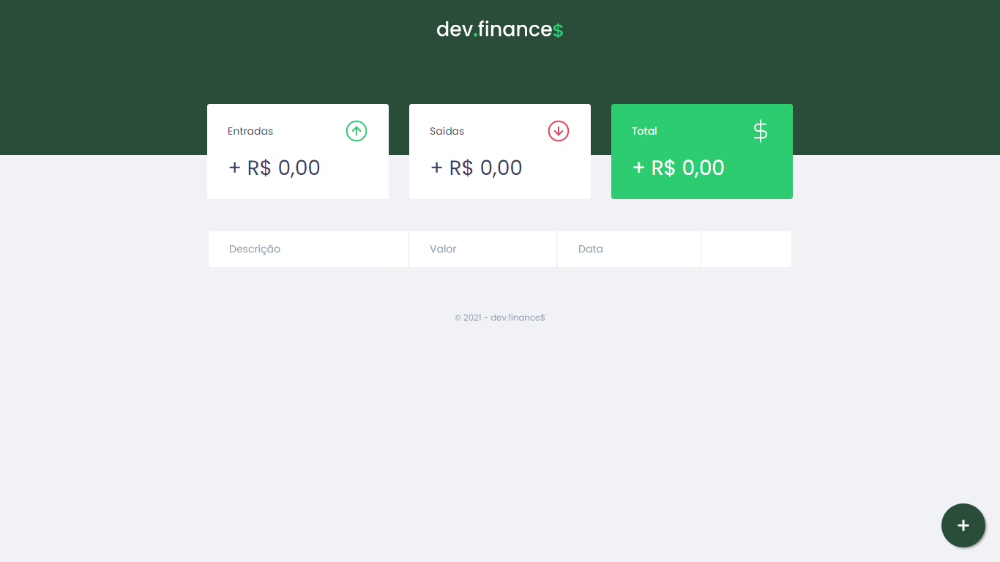
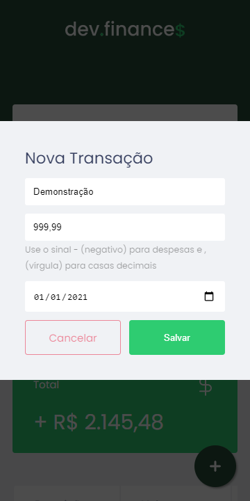

<h1 align="center">
  <br>
    
</h1>

<p align="center">
    <a href="#devfinances-">Projeto</a>&nbsp;&nbsp;&nbsp;|&nbsp;&nbsp;&nbsp;
    <a href="#tecnologias-">Tecnologias</a>&nbsp;&nbsp;&nbsp;|&nbsp;&nbsp;&nbsp;
    <a href="#layout-">Layout</a>&nbsp;&nbsp;&nbsp;|&nbsp;&nbsp;&nbsp;
    <a href="#licença-%EF%B8%8F">Licença</a>
</p>


Projeto desenvolvido para administrar melhor ganhos e gastos. Projeto realizado na Maratona Discover @Rocketseat.

#### Funcionalidades
* Site para administrar ganhos e gastos (controle financeiro)
* Cadastro e exclusão de transações
* Visualização do saldo de entrada e saída.
* Float Button
* Scrollbar personalizado
* Toast de erro - (Modal)
* Mudança de cor no Card 'total' - (+$0,00 verde ↑ e -$0,01 vermelho ↓)

## Tecnologias 🚀
Esse projeto foi desenvolvido com as seguintes tecnologias:

- [Html](https://pt.wikipedia.org/wiki/HTML)
- [Css](https://pt.wikipedia.org/wiki/Cascading_Style_Sheets)
- [laravel](https://laravel.com/)

## Layout 🚧
#### Desktop Screenshot
<div style="display: flex; flex-direction: 'column'; align-items: 'center';">
<!-- Responsive, 1440 x 900, 50% (Laptop L - 1440px)-->
    
    
</div>

#### Mobile Screenshot
<div style="display: flex; flex-direction: 'row';">
<!-- Responsive, 425 x 900, 60% (Mobile L - 425px)-->
    
    
    
    
</div>

## Rodando o projeto 🚴🏻‍♂️

```bash

# Clone o repositório
$ git clone  github.com/danielberglopes/finacias.github.git

# Acesse a pasta do projeto no prompt de comando
$ cd Dev.Finances

# Abra o projeto com o navegador de sua preferência
$ index.html
```


Confira a [Contribuição](./CONTRIBUTING-pt.md) para ver como iniciar uma discussão e começar a contribuir.